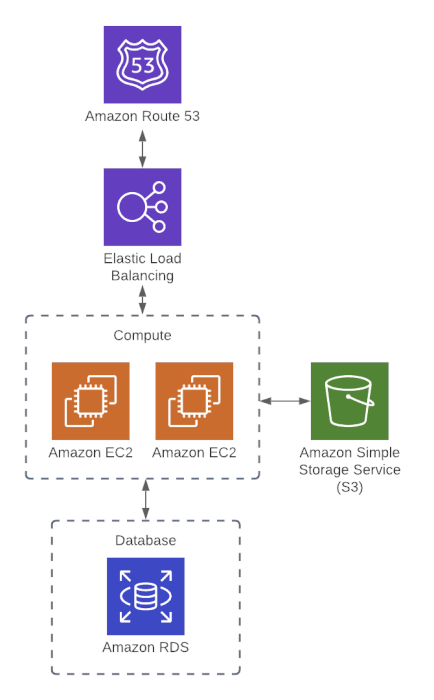

## DNS Nameservers

Add AWS Nameservers so that Route 53 settings will be applied:
- ns-1147.awsdns-15.org
- ns-161.awsdns-20.com
- ns-1629.awsdns-11.co.uk
- ns-876.awsdns-45.net

## Architecture

## Notes:
- Had to add security group with IP of ec2 instance for inbound access (by default inbound traffic was blocked)
- To connect to DB (`psql -U foo -d mydb -p 5432 -h terraform-20210127022433201300000001.cr2ub9wmsmpg.us-east-1.rds.amazonaws.com`)
